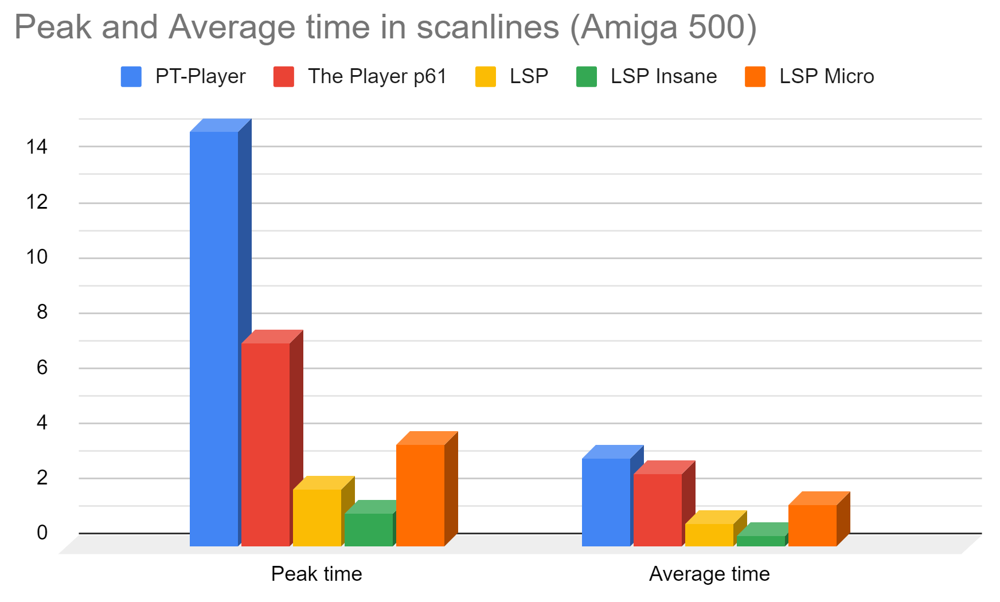
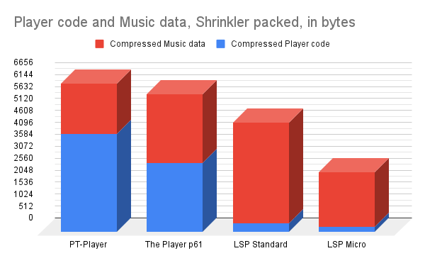

# Light Speed Player
# The fastest & Smallest 68k MOD music player ever

## What is LSP?

LSP (Light Speed Player) is the fastest 68000 MOD music player ever made. It can play any MOD file and *outperforms* all existing Amiga music player in speed.
LSP comes now with three different modes to fit all your needs:
- Standard mode: very fast ( average tick time is 1 scanline ), .MOD feature complete, less than 500bytes replay code
- Insane mode: ultra fast ( half scanline on average ). Use it if you'are writing optimized world record demos such as [Cycle-Op](https://www.pouet.net/prod.php?which=94129) :)
- Micro mode: still fast ( 1.5 scanline on average ). Music format is made to be compression friendly. Suited for 4KiB or 40KiB intros

Here is a speed comparaison of different Amiga music players. Numbers are given in "scanlines", measured on basic Amiga 500 OCS (PAL). Smaller is better


LSP Features  | Normal Mode | Insane Mode | Micro mode
----------|-------------|------------|------------
Code size | ~ 500 bytes | ~16KiB, depends of music | packed 224 bytes
Average Time | 0.83 scanline         | 0.46 scanline | 1.54 scanlines
Peak Time | 2.27 scanlines   | 1.34 scanline | 3.68 scanlines
GetPos | yes     | yes | no
SetPos | yes     | no | no
variable BPM | yes     | yes | no
Sample without note | yes     | yes | no

## Note about the new "-micro" mode

When using "micro" mode, the LSP music file will be larger in memory but compress very well. It's perfectly suited for small disk footprint applications such as 4KiB or 64KiB demos. 
To showcase the new micro mode, we took the great "e255" amiga demo music by Moby as an exemple. We measure the size of the music data only (we removed the wav samples, keeping only music score)

For a tiny disk footprint demo like 4KiB, you should also count the music player code size
Shrinkler packed | Player code | Music data | Total
--|----------------|-------------|----
Protracker | 4208 | 2148 | **6356**
the Player p61 | 2960 | 2944 | **5904**
LSP Standard | 380 | 4312 | **4692**
LSP Micro | 224 | 2340 | **2564**



*Note: In micro mode, don't panic when you see that your .lsmusic file has doubled in size! It's expected to improve the compression ratio, which is the most important thing for a tiny demo*

*Note: You can use "-pack" command line option to display an estimate of the .lsmusic Shrinkler compressed size*

## LSP is production ready!

LSP is already used in plenty of Amiga (and Atari :)) productions. Some are listed here:

Demo  | Type | Info
----------|-------------|------------
[HAMazing by Desire](https://www.pouet.net/prod.php?which=94348) | Amiga OCS Demo | 1st at 68k Inside 2023
[Cycle-Op by Oxygene](https://www.pouet.net/prod.php?which=94129) | Amiga OCS Demo | 3rd at Revision 2023
[4kAsm by Lemon.](https://www.pouet.net/prod.php?which=88604) | Amiga OCS 4KiB intro | 3rd at Revision 2021
[4k MegaScroller by Oxygene](https://www.pouet.net/prod.php?which=91996) | Atari STE 4KiB intro | 1st at SillyVenture 2022
[Water My Grey Beard by Loonies](https://www.pouet.net/prod.php?which=93409) | Amiga OCS 40KiB | 1st at Gerp 2023
[Frustro by Desire](https://www.pouet.net/prod.php?which=93416) | Amiga OCS 40KiB | 2nd at Gerp 2023
[Clubisque by SMFX & friends](https://www.pouet.net/prod.php?which=93403) | Amiga OCS Demo | 1st at Gerp 2023
[4KMOD by Oxygene & Alcatraz](https://www.pouet.net/prod.php?which=90430) | Atari STE 4KiB Intro | 2nd at Sillyventure 2021

More complete list can be found [here!](https://www.pouet.net/lists.php?which=200)


## LSPConvert.exe

To be so fast, LSP is using its own data format. LSPConvert is a win32 command line tool to convert any .mod file into LSP compatible files.
```c
LSPConvert rink-a-dink.mod -insane
```
This command will produce three files:
- rink-a-dink.lsmusic : music score, to be loaded in any amiga memory
- rink-a-dink.lsbank : wave sound bank, to be loaded in amiga chip memory
- rink-a-dink_insane.asm : dedicated ultra fast player for that music (see below)

```c
LSPConvert options:
        -v : verbose
        -insane : Generate insane mode fast replayer source code
        -getpos : Enable LSP_MusicGetPos function use
        -setpos : Enable LSP_MusicSetPos function use
        -micro : Produce larger but highly compressible .lsmusic file (need micro replayer)
        -shrink: shrink any non used sample data if possible
        -nosampleoptim : preserve orginal .MOD soundbank layout
        -amigapreview : generate a wav from LSP data (output simulated LSP Amiga player)
        -pack : display Amiga Schrinkler packing estimation size (.lsmusic file only)
        -nosettempo : remove $Fxx>$20 SetTempo support (for very old .mods compatiblity)
```

## Compiling LSPConvert yourself

If you're using windows system: download and install "Visual Studio 2022 Community", it's free and great. Open the src/LSPConvert.sln file project and profit!

If you're using another system, just format and install windows

## LSP Standard : LightSpeedPlayer.asm

LSP standard is a very fast and *small* replayer. Player code is less than 512 bytes! ( it could fit in half a boot sector :) ). Standard player takes 1 rasterline average time. LightSpeedPlayer.asm is low level player. You have to call player tick each frame at the correct music rate. You also have to set DMACon using copper. You can have a look at Example_Insane.asm

## LSP Micro : LightSpeedPlayer_micro.asm

LSP "micro" mode is made for tiny disk footprint intros. See "Note about the new -micro mode"

## LSP Standard : LightSpeedPlayer_cia.asm

LSP also comes with an easy toolkit player using CIA timer. You don't have to worry about DMACon etc. This toolkit also support variable BPM music. You can have a look at Example_Easy.asm. 

## LSP Insane : modfilename_insane.asm

LSP have a special "insane" mode with an ultra fast replayer. The insane player source code is generated by LSPConvert.exe. This mode is made for dedicated world record, where every cycle count :) Standard mode should be enough for anybody. But if you really need half a scanline to break a new world record, use insane mode! Only drawback of insane mode is the replay code could take up to 30KiB of code, depending of the .mod. ( standard player is less than 512 bytes! )

## Amiga 500 benchmark

You can test the Amiga bootable image floppy disk "benchmark.adf" to see how different amiga players run on your real hardware.


## Credits

* LSP converter, format & player by Arnaud Carré (aka Leonard/Oxygene : [@leonard_coder](https://twitter.com/leonard_coder) )
* LSPConvert uses "micromod" library by Martin Cameron to load & analyze the .mod file
