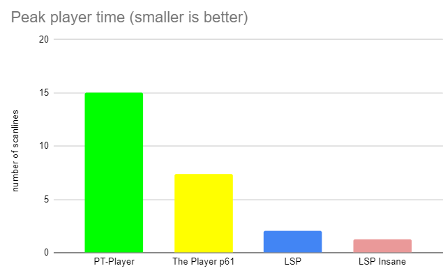
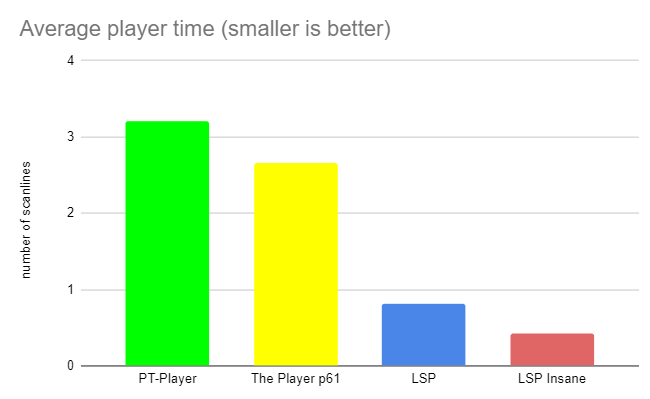

# Light Speed Player v1.03
# The fastest Amiga music player ever

## What is LSP?

LSP (Light Speed Player) is a very fast Amiga music player. It can play any MOD file and *outperforms* all existing Amiga music player in speed.
LSP comes with two different players: standard and insane. Standard is really fast, and insane is ultra fast!
Here is a speed comparaison of different Amiga music players. Numbers are given in "scanlines", measured on basic Amiga 500 OCS (PAL). Smaller is better





## LSPConvert.exe

To be so fast, LSP is using its own data format. LSPConvert is a win32 command line tool to convert any .mod file into LSP compatible files.
```c
LSPConvert rink-a-dink.mod
```
This command will produce three files:
- rink-a-dink.lsmusic : music score, to be loaded in any amiga memory
- rink-a-dink.lsbank : wave sound bank, to be loaded in amiga chip memory
- rink-a-dink_insane.asm : dedicated ultra fast player for that music (see below)

```c
LSPConvert options:
	-v : verbose
	-noinsane : do not generate insanely fast player
	-nosampleoptim : preserve orginal .MOD soundbank layout
	-renderwav : generate a .wav from .mod (output PC mod parser)
	-amigapreview : generate a wav from LSP data (output simulated LSP Amiga player)
	-nosettempo : remove $Fxx>$20 SetTempo support (for old .mods compatiblity)
```

## LSP Standard : LightSpeedPlayer.asm

LSP standard is a very fast and *small* replayer. Player code is less than 512 bytes! ( it could fit in half a boot sector :) ). Standard player takes 1 rasterline average time. LightSpeedPlayer.asm is low level player. You have to call player tick each frame at the correct music rate. You also have to set DMACon using copper. You can have a look at Example_Insane.asm

## LSP Standard : LightSpeedPlayer_cia.asm

LSP also comes with an easy toolkit player using CIA timer. You don't have to worry about DMACon etc. This toolkit also support variable BPM music. You can have a look at Example_Easy.asm. 

## LSP Insane : modfilename_insane.asm

LSP have a special "insane" mode with an ultra fast replayer. The insane player source code is generated by LSPConvert.exe. This mode is made for dedicated world record, where every cycle count :) Standard mode should be enough for anybody. But if you really need half a scanline to break a new world record, use insane mode! Only drawback of insane mode is the replay code could take up to 30KiB of code, depending of the .mod. ( standard player is less than 512 bytes! )

## Amiga 500 benchmark

You can test the Amiga bootable image floppy disk "benchmark.adf" to see how different amiga players run on your real hardware.


## Credits

* LSP converter, format & player by Arnaud Carré (aka Leonard/Oxygene : [@leonard_coder](https://twitter.com/leonard_coder) )
* LSPConvert uses "micromod" library by Martin Cameron to load & analyze the .mod file
